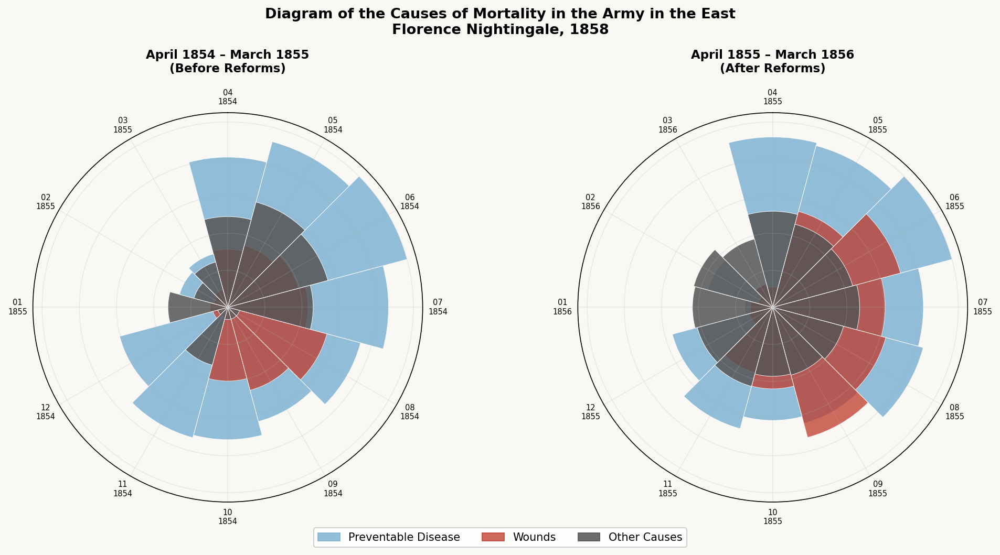

# Florence Nightingale's Rose Diagram — A Replication


## The Story

During the Crimean War (1853–1856), Florence Nightingale discovered that the majority of British soldiers were dying not from battle wounds, but from preventable infectious diseases caused by poor sanitation in military hospitals. Faced with military officials who dismissed statistical tables, she invented the polar area diagram — now known as the rose diagram — to make the pattern impossible to ignore. Her visualization directly influenced British military policy, triggering sanitary reforms that dramatically reduced preventable deaths in the army.

## How the Data Was Collected

I built a Python application that allowed me to click directly on Nightingale's original diagram image to extract radius measurements for each monthly wedge. For every month, I clicked the outer edge of three color layers — blue (disease), red (wounds), and black (other causes) — and the app calculated the pixel distance from the chart center to each point. Those distances were saved as JSON after every single click, and then exported as a CSV file containing the radius measurements for all 24 months.

## The Math and Visualization

- Distances from the center of each chart to the outer edge of each color layer were measured in pixels to produce radius values.
- Because the diagram encodes data as area rather than radius, areas are proportional to r² — a wedge with twice the radius has four times the area.
- Each wedge is divided into three concentric layers, one for each cause of death, allowing direct visual comparison across months and between the two time periods.

## The Visualization



## Key Insights

- Before sanitary reforms (April 1854 – March 1855), the blue wedges — representing preventable disease — dominate the diagram, dwarfing deaths from wounds and other causes, especially in the winter months.
- After reforms were implemented (April 1855 – March 1856), the blue wedges collapse dramatically, showing that disease deaths fell sharply once basic sanitation was improved.
- This visualization demonstrates that data, when presented clearly, can override assumptions and drive policy change — officials who would never read a table of numbers could not look away from this diagram.
- The contrast between the two charts is so stark that the argument makes itself: the reforms worked, and the numbers prove it.

## Technical Details

- Language: Python 3.7+
- Libraries: matplotlib, numpy, Pillow
- Files:
  - `src/digitizer.py` — interactive click-based data collection app
  - `data/coordinates.json` — raw pixel coordinates saved during digitization
  - `data/nightingale_computed.csv` — exported radius measurements for all 24 months

## How to Run

1. Clone this repository.
2. Install dependencies:
   ```
   pip install -r requirements.txt
   ```
3. Place `Nightingale-mortality.jpg` in the same folder as `digitizer.py`.
4. Run the digitizer:
   ```
   python src/digitizer.py
   ```

## What I Learned

Technically, I had never built an interactive application before — one where clicking on an image could capture coordinates, draw visual feedback, and save data automatically. Seeing the app recognize where I clicked, draw a line from the center to that point, and turn it into a number felt genuinely surprising to me. Beyond the code, this project changed how I think about data: raw numbers sit invisible in tables, but the right visualization makes a pattern impossible to miss — and that difference can change decisions, policies, and lives.

## References

- Florence Nightingale, *Diagram of the Causes of Mortality in the Army in the East* (1858)
- matplotlib documentation: https://matplotlib.org
- GitHub repository: https://github.com/kian-ney/portfolio
